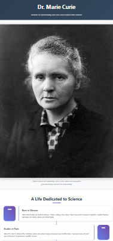

# 🚀 Marie Curie Tribute Page


A beautiful, responsive tribute page dedicated to Dr. Marie Curie, the pioneering scientist and two-time Nobel Prize winner. This tribute page features an elegant design with timeline layout, interactive elements, and comprehensive information about her groundbreaking contributions to science.

## 📸 Screenshots

<div align="center">
  
  <p><em>Elegant tribute page celebrating the life and achievements of Dr. Marie Curie</em></p>
</div>

## ✨ Live Demo

🌐 **[View Marie Curie Tribute Page](https://tribute-page-shibam.vercel.app)**

## 🚀 Key Features

- **🎨 Elegant Design**: Beautiful, respectful tribute layout with sophisticated styling
- **📱 Fully Responsive**: Mobile-first design optimized for all devices
- **📅 Interactive Timeline**: Chronological journey through Marie Curie's life
- **🖼️ Image Gallery**: Historical photographs and scientific imagery
- **📚 Comprehensive Biography**: Detailed information about her life and achievements
- **🏆 Awards Section**: Highlighting her Nobel Prizes and other recognitions
- **💡 Scientific Contributions**: Overview of her groundbreaking research
- **🎭 Smooth Animations**: CSS transitions and scroll-triggered effects
- **♿ Accessibility**: WCAG compliant with proper semantic structure
- **⚡ Fast Loading**: Optimized images and efficient code structure

## 🎨 Design System

### Color Palette
- **Primary**: Elegant purples and golds reflecting scientific excellence
- **Accent**: Warm tones for highlighting achievements
- **Background**: Clean whites with subtle textures
- **Text**: High contrast for optimal readability

### Typography
- **Headings**: Elegant serif fonts for formal presentation
- **Body Text**: Clean, readable sans-serif typography
- **Quotes**: Stylized text for memorable quotes

## 📱 Page Sections

1. **👑 Header** - Portrait and introduction to Marie Curie
2. **📖 Biography** - Early life and education background
3. **📅 Timeline** - Chronological life events and achievements
4. **🔬 Scientific Work** - Research contributions and discoveries
5. **🏆 Awards & Recognition** - Nobel Prizes and honors
6. **💭 Legacy** - Impact on science and society
7. **📚 References** - Additional resources and links

## 🛠️ Tech Stack

- **⚡ Frontend**: HTML5, CSS3, JavaScript (ES6+)
- **🎨 Styling**: Custom CSS with Flexbox and Grid
- **🎭 Animations**: CSS transitions and JavaScript interactions
- **📱 Responsive**: Mobile-first design approach
- **🔍 SEO**: Semantic HTML and proper meta tags
- **♿ Accessibility**: WCAG 2.1 AA compliant

## 🚀 Getting Started

### Prerequisites

- Web browser (Chrome, Firefox, Safari, Edge)
- Text editor (VS Code, Sublime Text, etc.)
- Basic knowledge of HTML, CSS, and JavaScript

### Installation

1. **Clone the repository**
   ```bash
   git clone https://github.com/Shibam-Code-Pro/tribute-page.git
   cd tribute-page
   ```

2. **Open the project**
   ```bash
   # Simply open index.html in your browser
   open index.html
   # or
   start index.html
   ```

3. **For development**
   - Use a local server like Live Server extension in VS Code
   - Or use Python's built-in server: `python -m http.server 8000`

## 📁 Project Structure

```
tribute-page/
├── 📄 index.html              # Main HTML file with tribute content
├── 🎨 styles.css              # CSS styles and responsive design
├── ⚡ script.js               # JavaScript animations and interactions
├── 📸 screenshot/             # Project screenshots
│   └── tribute-page.png
├── 📖 README.md               # Project documentation
├── 📜 LICENSE                 # MIT License
└── 🚫 .gitignore              # Git ignore rules
```

## 🛠️ Technologies Used

<table>
<tr>
<td align="center"><br><b>HTML5</b></td>
<td align="center"><br><b>CSS3</b></td>
<td align="center"><br><b>JavaScript</b></td>
<td align="center"><br><b>Git</b></td>
<td align="center"><br><b>VS Code</b></td>
</tr>
</table>

## 🎯 Tribute Features

### 📅 Interactive Timeline

- **Chronological Layout**: Life events in chronological order
- **Visual Indicators**: Timeline markers and connecting lines
- **Hover Effects**: Interactive timeline items with additional details
- **Responsive Design**: Adapts to mobile and tablet layouts

### 🖼️ Image Integration

- **Historical Photos**: Authentic photographs from different periods
- **Scientific Imagery**: Laboratory and research-related images
- **Responsive Images**: Optimized for all screen sizes
- **Accessibility**: Proper alt text for all images

### 🏆 Achievement Highlights

- **Nobel Prizes**: Detailed information about both Nobel Prizes
- **Scientific Discoveries**: Radioactivity research and element discoveries
- **Firsts**: First woman professor at University of Paris
- **Legacy**: Impact on modern science and women in STEM

## 🌐 Deployment

### 🚀 Quick Deploy Options

1. **GitHub Pages**
   - Push to GitHub repository
   - Enable GitHub Pages in repository settings
   - Access via `https://username.github.io/repository-name`

2. **Netlify**
   - Drag and drop project folder to Netlify
   - Get instant live URL
   - Automatic HTTPS and CDN

3. **Vercel**
   - Import GitHub repository
   - Deploy with zero configuration
   - Perfect for tribute pages

### 🔧 Pre-Deployment Checklist

- ✅ Test all interactive elements
- ✅ Verify responsive design on all devices
- ✅ Check image loading and optimization
- ✅ Test accessibility with screen readers
- ✅ Update live demo URL in README

## 📊 Performance Features

- **Image Optimization**: Compressed historical images for faster loading
- **CSS Optimization**: Efficient stylesheets and animations
- **Semantic HTML**: Proper document structure for accessibility
- **SEO**: Biography-focused meta tags and descriptions
- **Accessibility**: Full keyboard navigation and screen reader support

## 🎯 Special Features

### 📚 Educational Content
- Comprehensive biography with historical context
- Scientific achievements explained in accessible language
- Timeline of major life events and discoveries

### 🎨 Visual Design
- Elegant color scheme reflecting the subject's dignity
- Typography choices that enhance readability
- Balanced layout with proper visual hierarchy

### 📱 Mobile Experience
- Touch-friendly timeline navigation
- Optimized image viewing on mobile devices
- Responsive typography and spacing

## 🔧 Customization Guide

### Creating Your Own Tribute

1. **Replace Content**: Update HTML with your chosen subject's information
2. **Update Images**: Replace with relevant photographs and imagery
3. **Modify Timeline**: Adjust timeline events and dates
4. **Customize Styling**: Update colors and fonts to match your subject

### Adding New Sections

1. Add new HTML sections in `index.html`
2. Create corresponding CSS styles in `styles.css`
3. Add JavaScript functionality in `script.js` if needed
4. Update navigation and internal links

## 📝 License

This project is open source and available under the [MIT License](LICENSE).

## 🤝 Contributing

Contributions, issues, and feature requests are welcome! Feel free to check the [issues page](https://github.com/Shibam-Code-Pro/tribute-page/issues).

## 📞 Contact

**Shibam Banerjee**
- Email: Connect-With-Shibam@outlook.com
- Phone: +91 62902-18960
- LinkedIn: [linkedin.com/in/shibam-webdev](https://linkedin.com/in/shibam-webdev)
- GitHub: [github.com/Shibam-Code-Pro](https://github.com/Shibam-Code-Pro)

## 🙏 Acknowledgments

- [Marie Curie Biography](https://www.nobelprize.org/prizes/physics/1903/marie-curie/biographical/) for historical information
- [Wikimedia Commons](https://commons.wikimedia.org/) for historical photographs
- [HTML5](https://developer.mozilla.org/en-US/docs/Web/HTML) for semantic structure
- [CSS3](https://developer.mozilla.org/en-US/docs/Web/CSS) for styling capabilities
- [JavaScript](https://developer.mozilla.org/en-US/docs/Web/JavaScript) for interactivity

---

⭐ **If you found this project helpful, please give it a star!** ⭐
